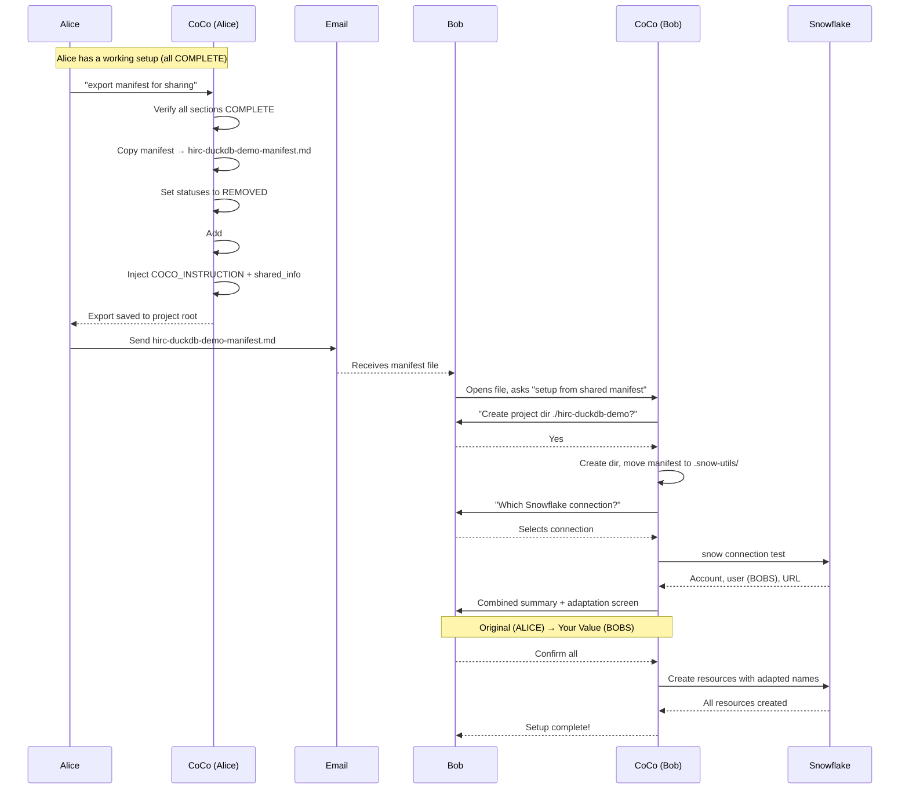

# Snowflake Infrastructure Skills for Cortex Code

[Cortex Code](https://docs.snowflake.com/en/user-guide/cortex-code/cortex-code) skills for Snowflake infrastructure automation.

> **Repository:** `snow-utils-skills`

## What is this?

A collection of skills that enable natural language automation of common Snowflake infrastructure tasks. Ask Cortex Code to create service accounts, network rules, or external volumes - it handles the complexity.

> [!NOTE]
> This repository contains the **skills** (SKILL.md + scripts). The source code is maintained in [snow-utils](https://github.com/kameshsampath/snow-utils).

## Skills

| Skill | Description | Sample Prompts |
|-------|-------------|----------------|
| [snow-utils-pat](./snow-utils-pat/) | Service account PAT creation | "Create a PAT for service account", "Rotate my PAT" |
| [snow-utils-networks](./snow-utils-networks/) | Network rules & policies | "Create network rule for my IP", "Allow GitHub Actions" |
| [snow-utils-volumes](./snow-utils-volumes/) | External volumes for Iceberg | "Create external volume for S3" |

## Installation

Add skills to your Cortex Code instance:

```bash
# Add all skills
cortex skill add https://github.com/kameshsampath/snow-utils-skills

# Or add individual skills
cortex skill add https://github.com/kameshsampath/snow-utils-skills/snow-utils-pat
cortex skill add https://github.com/kameshsampath/snow-utils-skills/snow-utils-networks
cortex skill add https://github.com/kameshsampath/snow-utils-skills/snow-utils-volumes
```

## Quick Start

### 1. Install Cortex Code

Follow the [Cortex Code installation guide](https://docs.snowflake.com/en/user-guide/cortex-code/cortex-code).

### 2. Add Skills

```bash
cortex skill add https://github.com/kameshsampath/snow-utils-skills
```

### 3. Use Natural Language

Open Cortex Code and try:

```
"Create a PAT for my service account"
"Create a network rule for my local IP"
"Set up an external volume for S3"
```

> [!TIP]
> Skills automatically check for required tools (uv, snow, aws) and prompt you to install any that are missing.

## Design Principles

These skills follow [12-factor app](https://12factor.net/) principles:

### Environment-Based Configuration

All configuration via environment variables in `.env`:

```bash
SNOWFLAKE_DEFAULT_CONNECTION_NAME=myconn
SA_ADMIN_ROLE=ACCOUNTADMIN
SNOW_UTILS_DB=MY_UTILS_DB
```

> [!TIP]
> Skills auto-detect shared configuration. Run PAT skill first, and Networks skill will detect `SA_ADMIN_ROLE` automatically.

### Manifest-Driven Operations

All resources are tracked in `.snow-utils/snow-utils-manifest.md`:

| Operation | How it works |
|-----------|--------------|
| **Create** | Records resources with status `COMPLETE` |
| **Cleanup** | Sets status to `REMOVED` (preserves history) |
| **Replay** | Reads manifest, recreates resources |
| **Resume** | Continues from `IN_PROGRESS` state |
| **Audit** | Review what was created and when |

#### Manifest Format

Each resource gets a unique section with markers:

```markdown
<!-- START -- snow-utils-pat:MYAPP_RUNNER -->
## PAT: MYAPP_RUNNER

| Field | Value |
|-------|-------|
| User | MYAPP_RUNNER |
| PAT Name | MYAPP_RUNNER_PAT |
| Expires | 2026-05-04 |
| Status | COMPLETE |
<!-- END -- snow-utils-pat:MYAPP_RUNNER -->

<!-- START -- snow-utils-networks:MYAPP_LOCAL -->
## Network Rule: MYAPP_LOCAL

| Field | Value |
|-------|-------|
| Rule | MYAPP_LOCAL_ACCESS |
| Policy | MYAPP_LOCAL_POLICY |
| Status | REMOVED |
<!-- END -- snow-utils-networks:MYAPP_LOCAL -->
```

#### Operation Flow

| Operation | Before | After | Trigger Phrases |
|-----------|--------|-------|-----------------|
| **Create** | (no section) | Section with `COMPLETE` | "create PAT", "create network rule" |
| **Cleanup** | `COMPLETE` | `REMOVED` | "cleanup", "remove resources" |
| **Replay** | `REMOVED` | `COMPLETE` (recreated) | "replay manifest", "recreate" |
| **Resume** | `IN_PROGRESS` | `COMPLETE` | "resume", "continue setup" |

> [!TIP]
> Say "replay the manifest" to recreate all REMOVED resources in a new conversation.

> [!IMPORTANT]
> The manifest is the source of truth. Don't edit it manually.

### Idempotent Operations

- `CREATE OR REPLACE` for network rules
- `CREATE IF NOT EXISTS` for policies
- Safe to re-run without side effects

### Interactive by Default

- Every destructive operation requires explicit confirmation
- Dry-run preview before execution
- Clear prompts with sensible defaults

## Shared Manifests

The manifest can be **exported and shared** with another developer so they can replay the entire setup on their machine — no manual configuration needed.

### How It Works: Alice Shares With Bob



### Key Concepts

| Concept | Description |
|---------|-------------|
| **Export precondition** | All skill sections must be `COMPLETE` before export |
| **Project-named file** | Export creates `{project_name}-manifest.md` in project root (not in `.snow-utils/`) |
| **ADAPT markers** | User-prefixed values get `# ADAPT: user-prefixed` so CoCo offers name adaptation |
| **3-prompt replay** | Project directory → Connection name → Combined summary + adaptation → done |
| **Canonical path rule** | Skills only read from `.snow-utils/snow-utils-manifest.md` — exported file is invisible to skill flows |

### Example: Exported Manifest (What Bob Receives)

```markdown
<!-- COCO_INSTRUCTION: This is a shared snow-utils manifest.
     project_name: hirc-duckdb-demo
     To set up: open this file in Cursor and ask "setup from shared manifest".
     CoCo will create the project directory, move this file into place, and replay. -->

# Snow-Utils Manifest

## shared_info
shared_by: ALICE
shared_date: 2026-02-07
original_project_dir: hirc-duckdb-demo
notes: |
  To replay: open in Cursor, ask "setup from shared manifest"

## project_recipe
project_name: hirc-duckdb-demo

<!-- START: snow-utils-pat -->
## snow-utils-pat
**Status:** REMOVED
**User:** ALICE_HIRC_DUCKDB_DEMO_RUNNER  # ADAPT: user-prefixed
**Role:** ALICE_HIRC_DUCKDB_DEMO_ACCESS  # ADAPT: user-prefixed
**Database:** ALICE_SNOW_UTILS  # ADAPT: user-prefixed
**Default Expiry (days):** 90
**Max Expiry (days):** 365
**Actual Expiry:** 2026-05-08
...
<!-- END: snow-utils-pat -->
```

### Name Adaptation (Combined Summary Screen)

When Bob replays, CoCo detects the prefix mismatch and shows one unified screen:

```
Replaying shared manifest for: hirc-duckdb-demo
Shared by: ALICE | Your user: BOBS

  Resource                    Original (ALICE)                     → Your Value (BOBS)
  ─────────────────────────────────────────────────────────────────────────────────────
  Service User                ALICE_HIRC_DUCKDB_DEMO_RUNNER        → BOBS_HIRC_DUCKDB_DEMO_RUNNER
  Service Role                ALICE_HIRC_DUCKDB_DEMO_ACCESS        → BOBS_HIRC_DUCKDB_DEMO_ACCESS
  Utils Database              ALICE_SNOW_UTILS                     → BOBS_SNOW_UTILS
  ─────────────────────────────────────────────────────────────────────────────────────
  S3 Bucket                   my-iceberg-bucket                     (unchanged)
  Region                      us-west-2                             (unchanged)

Options:
1. Confirm all (with adaptations) → proceed
2. Edit a specific value
3. Keep original names → proceed
```

### Trigger Phrases

| Action | Phrases |
|--------|---------|
| Export | "export manifest for sharing" |
| Import/Setup | "setup from shared manifest", "replay from shared manifest", "import shared manifest" |

## Project Structure

```
snow-utils-skills/
├── common/                    # Shared Python utilities
├── snow-utils-pat/           # PAT skill
│   ├── SKILL.md              # Skill workflow (for CoCo)
│   ├── README.md             # User documentation
│   └── scripts/              # CLI tools
├── snow-utils-networks/      # Networks skill
│   ├── SKILL.md
│   ├── README.md
│   └── scripts/
├── snow-utils-volumes/       # Volumes skill
│   ├── SKILL.md
│   ├── README.md
│   └── scripts/
├── TESTING.md                # Test cases for all skills
└── TODO.md                   # v2 roadmap
```

## Documentation

- [Cortex Code Documentation](https://docs.snowflake.com/en/user-guide/cortex-code/cortex-code)
- [Snowflake CLI Documentation](https://docs.snowflake.com/en/developer-guide/snowflake-cli/index)

## Related

- [snow-utils](https://github.com/kameshsampath/snow-utils) - Source repository with core scripts

## License

Apache 2.0
