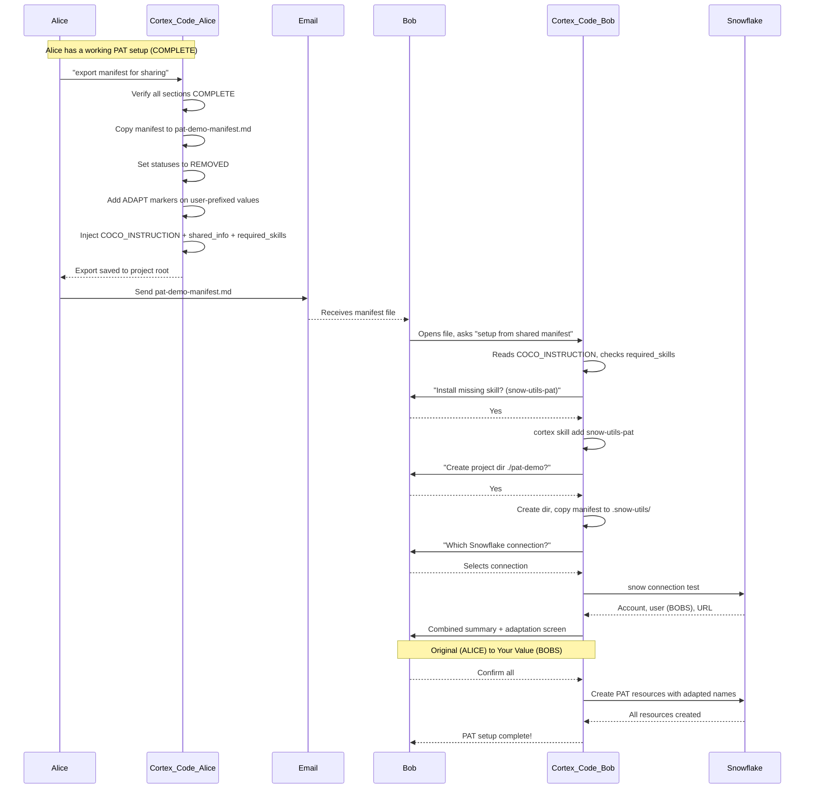

# Snowflake Infrastructure Skills for Cortex Code

[Cortex Code](https://docs.snowflake.com/en/user-guide/cortex-code/cortex-code) skills for Snowflake infrastructure automation.

> **Repository:** `snow-utils-skills`

## What is this?

A collection of skills that enable natural language automation of common Snowflake infrastructure tasks. Ask Cortex Code to create service accounts, network rules, or external volumes - it handles the complexity.

> [!NOTE]
> This repository contains the **skills** (SKILL.md files). Scripts are consumed as CLI entry points via the [snow-utils](https://github.com/kameshsampath/snow-utils) git dependency.

## Skills

| Skill | Description | Sample Prompts |
|-------|-------------|----------------|
| [snow-utils-pat](./snow-utils-pat/) | Service account PAT creation | "Create a PAT for service account", "Rotate my PAT" |
| [snow-utils-networks](./snow-utils-networks/) | Network rules & policies | "Create network rule for my IP", "Allow GitHub Actions" |
| [snow-utils-volumes](./snow-utils-volumes/) | External volumes for Iceberg | "Create external volume for S3" |

## Installation

Add skills to your Cortex Code instance:

```bash
# Add all skills
cortex skill add https://github.com/kameshsampath/snow-utils-skills

# Or add individual skills
cortex skill add https://github.com/kameshsampath/snow-utils-skills/snow-utils-pat
cortex skill add https://github.com/kameshsampath/snow-utils-skills/snow-utils-networks
cortex skill add https://github.com/kameshsampath/snow-utils-skills/snow-utils-volumes
```

## Quick Start

### 1. Install Cortex Code

Follow the [Cortex Code installation guide](https://docs.snowflake.com/en/user-guide/cortex-code/cortex-code).

### 2. Add Skills

```bash
cortex skill add https://github.com/kameshsampath/snow-utils-skills
```

### 3. Use Natural Language

Open Cortex Code and try:

```
"Create a PAT for my service account"
"Create a network rule for my local IP"
"Set up an external volume for S3"
```

> [!TIP]
> Skills automatically check for required tools (uv, snow, aws) and prompt you to install any that are missing.

## Design Principles

These skills follow [12-factor app](https://12factor.net/) principles:

### Environment-Based Configuration

All configuration via environment variables in `.env`:

```bash
SNOWFLAKE_DEFAULT_CONNECTION_NAME=myconn
SA_ADMIN_ROLE=ACCOUNTADMIN
SNOW_UTILS_DB=MY_UTILS_DB
```

> [!TIP]
> Skills auto-detect shared configuration. Run PAT skill first, and Networks skill will detect `SA_ADMIN_ROLE` automatically.

### Manifest-Driven Operations

All resources are tracked in `.snow-utils/snow-utils-manifest.md`:

| Operation | How it works |
|-----------|--------------|
| **Create** | Records resources with status `COMPLETE` |
| **Cleanup** | Sets status to `REMOVED` (preserves history) |
| **Replay** | Reads manifest, recreates resources |
| **Resume** | Continues from `IN_PROGRESS` state |
| **Audit** | Review what was created and when |

#### Manifest Format

Each resource gets a unique section with markers:

```markdown
<!-- START -- snow-utils-pat:MYAPP_RUNNER -->
## PAT: MYAPP_RUNNER

| Field | Value |
|-------|-------|
| User | MYAPP_RUNNER |
| PAT Name | MYAPP_RUNNER_PAT |
| Expires | 2026-05-04 |
| Status | COMPLETE |
<!-- END -- snow-utils-pat:MYAPP_RUNNER -->

<!-- START -- snow-utils-networks:MYAPP_LOCAL -->
## Network Rule: MYAPP_LOCAL

| Field | Value |
|-------|-------|
| Rule | MYAPP_LOCAL_ACCESS |
| Policy | MYAPP_LOCAL_POLICY |
| Status | REMOVED |
<!-- END -- snow-utils-networks:MYAPP_LOCAL -->
```

#### Operation Flow

| Operation | Before | After | Trigger Phrases |
|-----------|--------|-------|-----------------|
| **Create** | (no section) | Section with `COMPLETE` | "create PAT", "create network rule" |
| **Cleanup** | `COMPLETE` | `REMOVED` | "cleanup", "remove resources" |
| **Replay** | `REMOVED` | `COMPLETE` (recreated) | "replay manifest", "recreate" |
| **Resume** | `IN_PROGRESS` | `COMPLETE` | "resume", "continue setup" |

> [!TIP]
> Say "replay the manifest" to recreate all REMOVED resources in a new conversation.

> [!IMPORTANT]
> The manifest is the source of truth. Don't edit it manually.

### Idempotent Operations

- `CREATE OR REPLACE` for network rules
- `CREATE IF NOT EXISTS` for policies
- Safe to re-run without side effects

### Interactive by Default

- Every destructive operation requires explicit confirmation
- Dry-run preview before execution
- Clear prompts with sensible defaults

## Shared Manifests

The manifest can be **exported and shared** with another developer so they can replay the entire setup on their machine — no manual configuration needed.

### How It Works: Alice Shares With Bob



### Key Concepts

| Concept | Description |
|---------|-------------|
| **Export precondition** | All skill sections must be `COMPLETE` before export |
| **Project-named file** | Export creates `{project_name}-manifest.md` in project root (not in `.snow-utils/`) |
| **ADAPT markers** | User-prefixed values get `# ADAPT: user-prefixed` so Cortex Code offers name adaptation |
| **Self-installing** | Exported manifest includes `required_skills` with URLs — Cortex Code installs missing skills automatically |
| **3-prompt replay** | Project directory → Connection name → Combined summary + adaptation → done |
| **Canonical path rule** | Skills only read from `.snow-utils/snow-utils-manifest.md` — exported file is invisible to skill flows |

### Example: Exported Manifest (What Bob Receives)

```markdown
<!-- COCO_INSTRUCTION: This is a shared snow-utils manifest.
     project_name: pat-demo
     setup_steps:
       1. Check if required skills are installed: cortex skill list
       2. For each skill in ## required_skills NOT in the list, run: cortex skill add <url>
       3. Once all skills installed, ask "replay pat from manifest"
     To trigger: ask "setup from shared manifest" or "replay pat" -->

# Snow-Utils Manifest

## shared_info
shared_by: ALICE
shared_date: 2026-02-11
original_project_dir: pat-demo
notes: |
  PAT Demo - Create a Snowflake Programmatic Access Token for a service account.
  To replay: open in Cortex Code, ask "setup from shared manifest" or "replay pat"

## required_skills
snow-utils-pat: https://github.com/kameshsampath/snow-utils-skills/snow-utils-pat

## project_recipe
project_name: pat-demo

<!-- START -- snow-utils-pat:ALICE_PAT_DEMO_RUNNER -->
## PAT: ALICE_PAT_DEMO_RUNNER
**User:** ALICE_PAT_DEMO_RUNNER  # ADAPT: user-prefixed
**Role:** ALICE_PAT_DEMO_ACCESS  # ADAPT: user-prefixed
**Database:** ALICE_SNOW_UTILS  # ADAPT: user-prefixed
**PAT Name:** ALICE_PAT_DEMO_RUNNER_PAT  # ADAPT: user-prefixed
**Default Expiry (days):** 90
**Max Expiry (days):** 365
**Auth Policy:** ALICE_PAT_DEMO_RUNNER_AUTH_POLICY  # ADAPT: user-prefixed
**admin_role:** ACCOUNTADMIN
**Status:** REMOVED
<!-- END -- snow-utils-pat:ALICE_PAT_DEMO_RUNNER -->
```

### Name Adaptation (Combined Summary Screen)

When Bob replays, Cortex Code detects the prefix mismatch and shows one unified screen:

```
Replaying shared manifest for: pat-demo
Shared by: ALICE | Your user: BOBS

  Resource                    Original (ALICE)                → Your Value (BOBS)
  ────────────────────────────────────────────────────────────────────────────────
  Service User                ALICE_PAT_DEMO_RUNNER           → BOBS_PAT_DEMO_RUNNER
  Service Role                ALICE_PAT_DEMO_ACCESS           → BOBS_PAT_DEMO_ACCESS
  Utils Database              ALICE_SNOW_UTILS                → BOBS_SNOW_UTILS
  PAT Name                    ALICE_PAT_DEMO_RUNNER_PAT       → BOBS_PAT_DEMO_RUNNER_PAT
  Auth Policy                 ALICE_PAT_DEMO_RUNNER_AUTH_...  → BOBS_PAT_DEMO_RUNNER_AUTH_...

Options:
1. Confirm all (with adaptations) → proceed
2. Edit a specific value
3. Keep original names → proceed
```

### Remote Manifest URLs

Skills can also fetch shared manifests directly from URLs. Supported URL formats:

- **GitHub blob:** `https://github.com/{owner}/{repo}/blob/{branch}/{path}` (auto-translated to raw URL)
- **GitHub raw:** `https://raw.githubusercontent.com/...`
- **GitHub gist:** `https://gist.github.com/{user}/{id}`
- **Any HTTPS URL** ending in `.md`

Example:

```
"replay pat from https://github.com/kameshsampath/snow-utils-skills/blob/main/example-manifests/pat-demo-manifest.md"
```

Cortex Code will translate the URL to the raw download URL, confirm the download, save the file to the current directory, and then proceed with the normal shared manifest flow (including name adaptation).

### Trigger Phrases

| Action | Phrases |
|--------|---------|
| Export | "export manifest for sharing" |
| Import/Setup | "setup from shared manifest", "replay from shared manifest", "import shared manifest" |
| From URL | "setup from manifest URL", "replay from URL", "use manifest from `<url>`" |

## Example Manifests

The [`example-manifests/`](./example-manifests/) directory contains ready-to-use shared manifests for each skill:

| Manifest | Skill | Description |
|----------|-------|-------------|
| [pat-demo-manifest.md](./example-manifests/pat-demo-manifest.md) | snow-utils-pat | Standalone PAT setup |
| [networks-demo-manifest.md](./example-manifests/networks-demo-manifest.md) | snow-utils-networks | Standalone network rules setup |
| [volumes-demo-manifest.md](./example-manifests/volumes-demo-manifest.md) | snow-utils-volumes | Standalone external volume setup |

> [!TIP]
> Use these directly from a URL:
> ```
> "replay pat from https://github.com/kameshsampath/snow-utils-skills/blob/main/example-manifests/pat-demo-manifest.md"
> ```
> Cortex Code will download, adapt names for your account, and replay.

## Project Structure

```
snow-utils-skills/
├── example-manifests/        # Shared manifest examples
│   ├── pat-demo-manifest.md
│   ├── networks-demo-manifest.md
│   └── volumes-demo-manifest.md
├── snow-utils-pat/           # PAT skill
│   ├── SKILL.md              # Skill workflow (for Cortex Code)
│   ├── README.md             # User documentation
│   └── pyproject.toml        # Declares snow-utils git dependency
├── snow-utils-networks/      # Networks skill
│   ├── SKILL.md
│   ├── README.md
│   └── pyproject.toml
├── snow-utils-volumes/       # Volumes skill
│   ├── SKILL.md
│   ├── README.md
│   └── pyproject.toml
├── TESTING.md                # Test cases for all skills
└── TODO.md                   # v2 roadmap
```

## Documentation

- [Cortex Code Documentation](https://docs.snowflake.com/en/user-guide/cortex-code/cortex-code)
- [Snowflake CLI Documentation](https://docs.snowflake.com/en/developer-guide/snowflake-cli/index)

## Related

- [snow-utils](https://github.com/kameshsampath/snow-utils) - Source repository with core scripts

## License

Apache 2.0
